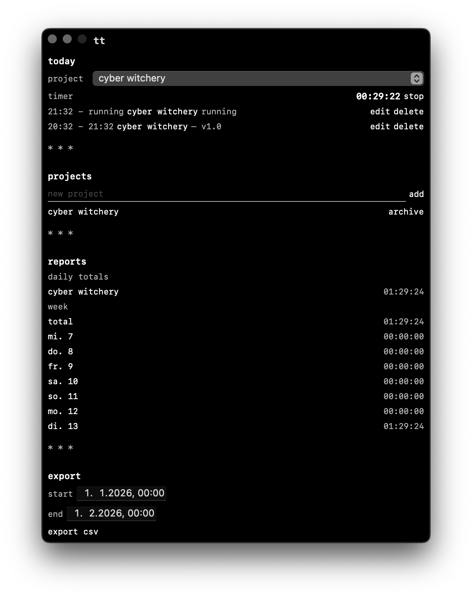

# tt

tt is a local-first, macOS-only time tracker with a brutalist, text-first ui.

co-evolved using ai.

* * *

## build + run

- open `tt.xcodeproj` in Xcode
- select the `tt` scheme
- run on macOS 13+

* * *

## screenshots

* * *

## usage (mvp)

- click the menu bar `tt` → start/stop timer, pick project, open main window
- main window: today entries, projects, reports, export csv
- delete entries immediately from today list

* * *

## brutalist ui principles

- monochrome palette (black/white/gray)
- monospaced typography (`.monospaced` design)
- text-first layout, minimal padding
- square corners, hard dividers
- sections separated by `* * *`
- minimal navigation (text links, no icons)

* * *

## architecture

- domain: pure Swift models + time math
- persistence: SQLite via GRDB (single local database)
- app state: ObservableObject coordinating repositories + timer
- ui: SwiftUI views
